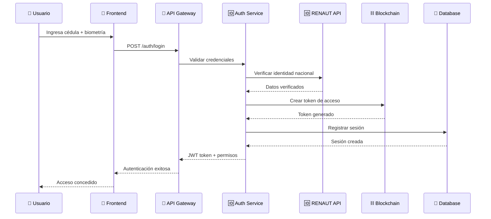
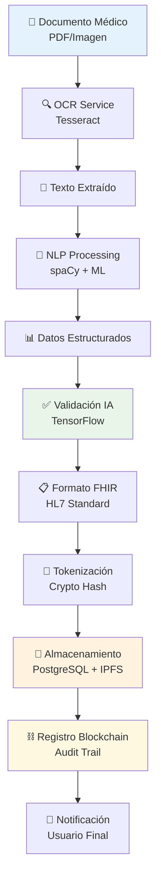
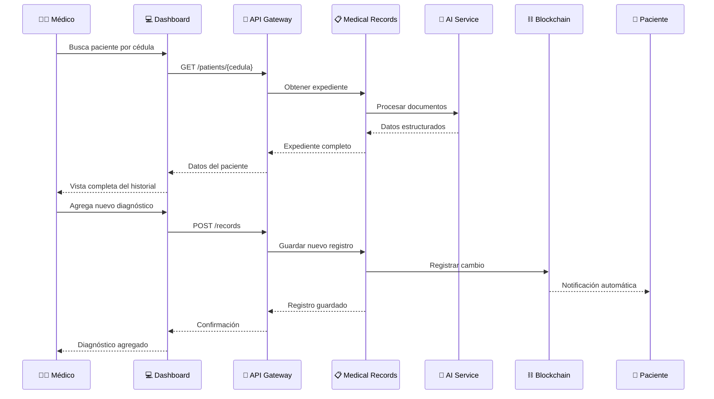
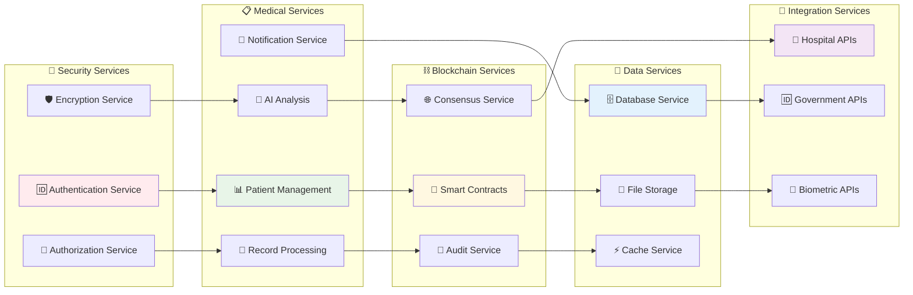
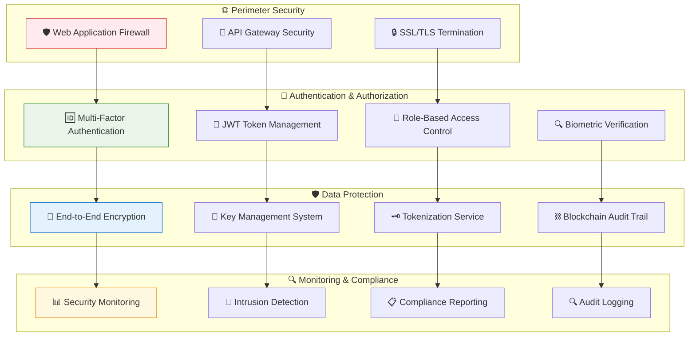
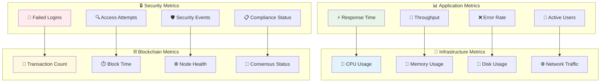

# 🏗️ Arquitectura del Sistema PanamaHealth Vault

## 📊 Diagrama de Arquitectura Completo

### Vista General del Sistema

```mermaid
graph TB
    subgraph "🌐 Frontend Layer"
        A[📱 App Móvil<br/>React Native<br/>iOS & Android]
        B[💻 Dashboard Médico<br/>React.js<br/>Web Application]
        C[👤 Portal Paciente<br/>React.js<br/>Web Interface]
    end
    
    subgraph "🔐 API Gateway Layer"
        D[🚪 FastAPI Gateway<br/>• Autenticación<br/>• Rate Limiting<br/>• Load Balancing<br/>• SSL Termination]
    end
    
    subgraph "🧠 Core Services Layer"
        E[🤖 AI Processing Service<br/>• OCR (Tesseract)<br/>• NLP (spaCy)<br/>• ML (TensorFlow)<br/>• Document Analysis]
        F[🔑 Tokenization Service<br/>• Crypto Operations<br/>• Blockchain Integration<br/>• Data Encryption<br/>• Key Management]
        G[📋 Medical Records Service<br/>• CRUD Operations<br/>• Data Validation<br/>• FHIR Compliance<br/>• Record Management]
        H[🆔 Biometric Auth Service<br/>• Cédula Validation<br/>• Fingerprint Auth<br/>• Face Recognition<br/>• Multi-Factor Auth]
    end
    
    subgraph "💾 Data Layer"
        I[🗄️ PostgreSQL<br/>• Structured Data<br/>• Patient Records<br/>• User Management<br/>• Audit Logs]
        J[📁 IPFS<br/>• Document Storage<br/>• Decentralized Files<br/>• Version Control<br/>• Content Addressing]
        K[⚡ Redis<br/>• Session Cache<br/>• Real-time Data<br/>• Rate Limiting<br/>• Performance Cache]
    end
    
    subgraph "⛓️ Blockchain Layer"
        L[🔗 Hyperledger Fabric<br/>• Smart Contracts<br/>• Access Control<br/>• Audit Trail<br/>• Consensus Mechanism]
        M[🌐 Consensus Network<br/>• Validation Nodes<br/>• Healthcare Partners<br/>• Government Nodes<br/>• Trust Network]
    end
    
    subgraph "🔌 External APIs"
        N[🆔 RENAUT API<br/>• National ID<br/>• Identity Verification<br/>• Biometric Data<br/>• Citizen Database]
        O[🏥 CSS/MINSA APIs<br/>• Health Systems<br/>• Patient Data<br/>• Medical Records<br/>• Institution Data]
        P[🔐 Biometric Services<br/>• Fingerprint Scanner<br/>• Face Recognition<br/>• Iris Scanner<br/>• Voice Recognition]
    end
    
    subgraph "☁️ Infrastructure"
        Q[🐳 Docker Containers<br/>• Microservices<br/>• Isolation<br/>• Scalability<br/>• Deployment]
        R[☸️ Kubernetes<br/>• Orchestration<br/>• Auto-scaling<br/>• Load Balancing<br/>• Service Discovery]
        S[☁️ AWS/GCP<br/>• Cloud Computing<br/>• Storage<br/>• CDN<br/>• Monitoring]
    end
    
    %% Frontend to API Gateway
    A --> D
    B --> D
    C --> D
    
    %% API Gateway to Core Services
    D --> E
    D --> F
    D --> G
    D --> H
    
    %% Core Services to Data Layer
    E --> I
    E --> J
    F --> L
    G --> I
    H --> K
    
    %% Blockchain Connections
    F --> L
    L --> M
    
    %% External API Connections
    H --> N
    H --> P
    G --> O
    
    %% Infrastructure
    Q --> R
    R --> S
    
    %% Styling
    style A fill:#e1f5fe,stroke:#01579b,stroke-width:2px
    style B fill:#e8f5e8,stroke:#2e7d32,stroke-width:2px
    style C fill:#fff3e0,stroke:#ef6c00,stroke-width:2px
    style E fill:#f3e5f5,stroke:#7b1fa2,stroke-width:2px
    style F fill:#e8f5e8,stroke:#2e7d32,stroke-width:2px
    style L fill:#fff8e1,stroke:#f57f17,stroke-width:3px
    style I fill:#fce4ec,stroke:#c2185b,stroke-width:2px
    style J fill:#e0f2f1,stroke:#00695c,stroke-width:2px
    style K fill:#fff3e0,stroke:#ef6c00,stroke-width:2px
```

## 🔄 Flujo de Datos del Sistema

### 1. Proceso de Autenticación



### 2. Procesamiento de Documentos Médicos



### 3. Acceso a Expediente Médico



## 🏗️ Arquitectura de Microservicios

### Servicios Principales



## 🔒 Arquitectura de Seguridad

### Capas de Seguridad



## 📊 Métricas y Monitoreo

### Dashboard de Monitoreo



## 🚀 Escalabilidad y Performance

### Estrategia de Escalabilidad

```mermaid
graph TB
    subgraph "📈 Horizontal Scaling"
        A[🔄 Load Balancer]
        B[📱 App Instances]
        C[💾 Database Sharding]
        D[📁 CDN Distribution]
    end
    
    subgraph "⚡ Performance Optimization"
        E[🗄️ Database Indexing]
        F[⚡ Redis Caching]
        G[📦 Connection Pooling]
        H[🔄 Async Processing]
    end
    
    subgraph "☁️ Cloud Infrastructure"
        I[🌐 Auto Scaling Groups]
        J[📊 Cloud Monitoring]
        K[🔄 Backup & Recovery]
        L[🌍 Multi-Region Deployment]
    end
    
    A --> B
    B --> C
    C --> D
    E --> F
    F --> G
    G --> H
    I --> J
    J --> K
    K --> L
    
    style A fill:#e8f5e8
    style E fill:#e3f2fd
    style I fill:#fff8e1
```



---

## 📋 Especificaciones Técnicas

### Requisitos del Sistema

| Componente | Especificación | Propósito |
|------------|----------------|-----------|
| **CPU** | 16+ cores | Procesamiento de IA y blockchain |
| **RAM** | 64+ GB | Carga de modelos ML y cache |
| **Storage** | 1TB+ SSD | Base de datos y documentos |
| **Network** | 10Gbps+ | Alto throughput de datos |
| **GPU** | NVIDIA RTX 4090+ | Aceleración de IA |

### Tecnologías de Soporte

- **Containerización:** Docker + Kubernetes
- **CI/CD:** GitHub Actions + ArgoCD
- **Monitoring:** Prometheus + Grafana
- **Logging:** ELK Stack (Elasticsearch, Logstash, Kibana)
- **Security:** HashiCorp Vault + OWASP ZAP

---

*Este documento de arquitectura es parte del proyecto PanamaHealth Vault para Samsung Innovation Campus 2025*
