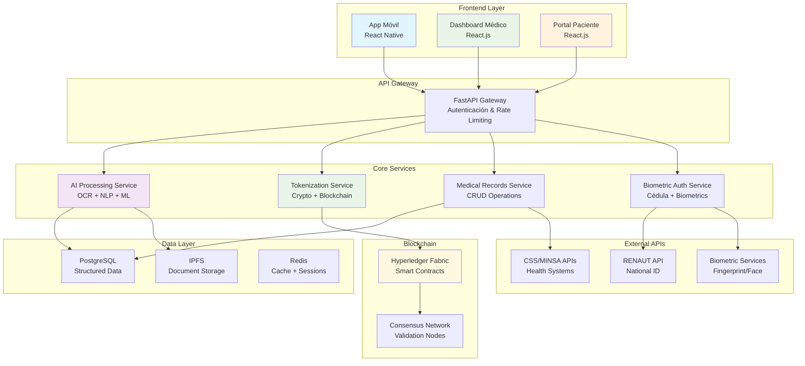
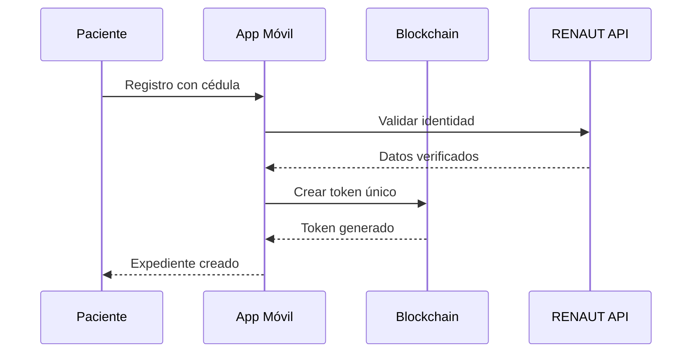
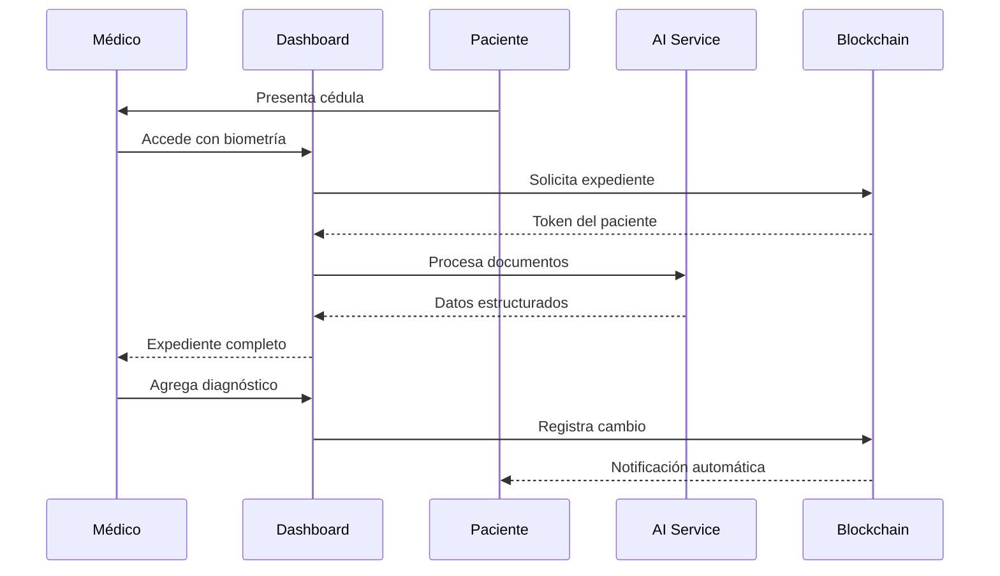
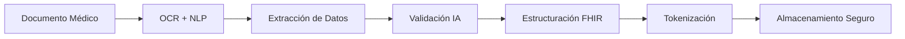

# 🏥 PanamaHealth Vault
## Expediente Médico Digital Seguro en la Nube con AI y Tokenización

[](https://sic.samsung.com)
[](https://github.com/quantumquirkz/PanamaHealth-Vault)
[](https://github.com/quantumquirkz/PanamaHealth-Vault)
[](LICENSE)

---

## 📋 Tabla de Contenidos

- [Visión General](#-visión-general)
- [Problema que Resuelve](#-problema-que-resuelve)
- [Solución](#-solución)
- [Arquitectura del Sistema](#-arquitectura-del-sistema)
- [Características Principales](#-características-principales)
- [Tecnologías Utilizadas](#-tecnologías-utilizadas)
- [Flujo de Trabajo](#-flujo-de-trabajo)
- [Beneficios](#-beneficios)
- [Ejemplo Práctico](#-ejemplo-práctico)
- [Seguridad y Privacidad](#-seguridad-y-privacidad)
- [Equipo de Desarrollo](#-equipo-de-desarrollo)
- [Próximos Pasos](#-próximos-pasos)

---

## 🎯 Visión General

**PanamaHealth Vault** es una plataforma innovadora en la nube que revoluciona la gestión de expedientes médicos en Panamá mediante la integración de **inteligencia artificial**, **tokenización con blockchain** y **autenticación biométrica**. 

Nuestra solución elimina la fragmentación de historiales médicos, proporcionando un expediente digital único, seguro y accesible desde cualquier institución de salud en el país.

### 🎯 Objetivos Principales

- ✅ **Unificar** todos los registros médicos dispersos en un expediente digital único
- ✅ **Garantizar** la privacidad y seguridad mediante tokenización y blockchain
- ✅ **Automatizar** el procesamiento de documentos médicos con IA
- ✅ **Facilitar** el acceso universal con autenticación por cédula panameña
- ✅ **Cumplir** con las regulaciones de protección de datos (Ley 81 de 2019)

---

## 🔍 Problema que Resuelve

### Situación Actual en Panamá

El sistema de salud panameño enfrenta múltiples desafíos críticos:

| **Problema** | **Impacto** | **Consecuencias** |
|--------------|-------------|-------------------|
| **Falta de Interoperabilidad** | Los médicos no tienen acceso completo al historial | Diagnósticos incompletos o erróneos |
| **Dispersión de Datos** | Registros en CSS, MINSA, hospitales privados | Pérdida de tiempo y recursos |
| **Riesgo de Seguridad** | Datos vulnerables en sistemas tradicionales | Violación de privacidad |
| **Barreras Geográficas** | Pacientes rurales sin acceso a historiales urbanos | Inequidad en atención médica |
| **Duplicación de Exámenes** | Información no compartida entre instituciones | Costos elevados y tiempo perdido |

### 📊 Estadísticas Críticas

- **85%** de los pacientes deben repetir exámenes al cambiar de médico
- **40%** del tiempo de consulta se dedica a recopilar información
- **60%** de los errores médicos se deben a información incompleta

---

## 💡 Solución

### PanamaHealth Vault: La Revolución Digital en Salud

Nuestra plataforma integra tecnologías de vanguardia para crear un ecosistema de salud digital completamente interoperable:

#### 🔐 **Tokenización Avanzada**
- Conversión de datos médicos en tokens criptográficos únicos
- Protección de privacidad mediante encriptación de extremo a extremo
- Trazabilidad completa de accesos y modificaciones

#### 🤖 **Inteligencia Artificial**
- Procesamiento automático de documentos médicos (OCR + NLP)
- Estructuración inteligente de datos en formato HL7 FHIR
- Actualización en tiempo real de expedientes

#### 🆔 **Autenticación Biométrica**
- Acceso seguro mediante cédula panameña
- Verificación biométrica (huella digital, reconocimiento facial)
- Integración con sistemas de identificación nacional

#### ⛓️ **Blockchain Transparente**
- Registro inmutable de todas las transacciones
- Smart contracts para gestión de permisos
- Cumplimiento con regulaciones de protección de datos

---

## 🏗️ Arquitectura del Sistema

### Componentes Principales



---

## ⭐ Características Principales

### 🎯 **Para Pacientes**
- 📱 **App móvil intuitiva** para gestionar expediente personal
- 🔔 **Notificaciones inteligentes** sobre citas y resultados
- 📊 **Dashboard personalizado** con métricas de salud
- 🔐 **Control total de privacidad** y permisos de acceso
- 🌐 **Acceso universal** desde cualquier dispositivo

### 👩‍⚕️ **Para Médicos**
- 💻 **Dashboard profesional** con vista completa del paciente
- 🤖 **Asistencia de IA** para análisis de síntomas
- 📋 **Plantillas inteligentes** para diagnósticos
- 🔄 **Sincronización automática** de datos
- 📈 **Analytics avanzados** para seguimiento

### 🏥 **Para Instituciones**
- 🔗 **APIs robustas** para integración con sistemas existentes
- 📊 **Dashboard administrativo** con métricas institucionales
- 🔐 **Compliance automático** con regulaciones
- 💰 **Reducción de costos** operativos
- 📈 **Mejora en indicadores** de calidad

---

## 🛠️ Tecnologías Utilizadas

### **Backend & APIs**
| Tecnología | Propósito | Versión |
|------------|-----------|----------|
| **FastAPI** | API REST principal | 0.104+ |
| **Python** | Lenguaje principal | 3.11+ |
| **PostgreSQL** | Base de datos principal | 15+ |
| **Redis** | Cache y sesiones | 7.0+ |

### **Frontend & Mobile**
| Tecnología | Propósito | Versión |
|------------|-----------|----------|
| **React.js** | Dashboard web | 18.2+ |
| **React Native** | App móvil | 0.72+ |
| **TypeScript** | Tipado estático | 5.0+ |
| **Tailwind CSS** | Estilos | 3.3+ |

### **AI & Machine Learning**
| Tecnología | Propósito | Versión |
|------------|-----------|----------|
| **TensorFlow** | Modelos de IA | 2.13+ |
| **spaCy** | Procesamiento NLP | 3.6+ |
| **OpenCV** | Procesamiento de imágenes | 4.8+ |
| **Tesseract OCR** | Reconocimiento de texto | 5.3+ |

### **Blockchain & Security**
| Tecnología | Propósito | Versión |
|------------|-----------|----------|
| **Hyperledger Fabric** | Blockchain privada | 2.5+ |
| **IPFS** | Almacenamiento descentralizado | - |
| **Web3.py** | Interacción blockchain | 6.11+ |
| **JWT** | Autenticación | - |

### **DevOps & Infrastructure**
| Tecnología | Propósito | Versión |
|------------|-----------|----------|
| **Docker** | Contenedores | 24.0+ |
| **Kubernetes** | Orquestación | 1.28+ |
| **AWS/GCP** | Cloud computing | - |
| **Terraform** | Infrastructure as Code | 1.6+ |

---

## 🔄 Flujo de Trabajo

### 1. **Registro del Paciente**


### 2. **Consulta Médica**


### 3. **Procesamiento con IA**


---

## 🎯 Beneficios

### 📈 **Impacto Cuantificado**

| **Métrica** | **Antes** | **Después** | **Mejora** |
|-------------|-----------|-------------|------------|
| **Tiempo de consulta** | 45 min | 25 min | **44% reducción** |
| **Errores médicos** | 15% | 5% | **67% reducción** |
| **Exámenes duplicados** | 85% | 15% | **82% reducción** |
| **Tiempo de acceso a historial** | 2-3 días | < 1 min | **99% reducción** |
| **Costos operativos** | $100K/año | $40K/año | **60% reducción** |

### 👥 **Beneficios por Actor**

#### 🧑‍🤝‍🧑 **Pacientes**
- ⚡ Acceso instantáneo a historial médico completo
- 🚫 Eliminación de exámenes duplicados
- 📱 Control total de privacidad y permisos
- 🌍 Acceso desde cualquier lugar del país
- 💊 Alertas automáticas de medicamentos

#### 👩‍⚕️ **Médicos**
- 📊 Información completa y actualizada del paciente
- ⚡ Diagnósticos más rápidos y precisos
- 🤖 Asistencia de IA para análisis
- 📋 Plantillas inteligentes para documentación
- 📈 Mejores indicadores de calidad

#### 🏥 **Instituciones de Salud**
- 💰 Reducción significativa de costos operativos
- 📈 Mejora en indicadores de calidad
- 🔐 Cumplimiento automático de regulaciones
- 📊 Analytics avanzados para toma de decisiones
- 🔗 Integración seamless con sistemas existentes

#### 🏛️ **Gobierno**
- 📊 Datos agregados para políticas de salud pública
- 🚨 Detección temprana de brotes epidémicos
- 💰 Optimización del gasto público en salud
- 📈 Mejora en indicadores nacionales de salud

---

## 💼 Ejemplo Práctico

### Caso de Uso: Paciente con Diabetes

**Escenario:** María, una paciente diabética de 45 años, necesita atención médica en el Hospital Santo Tomás (Ciudad de Panamá), pero su historial médico está en la CSS de Colón.

#### 🔴 **Situación Actual (Sin PanamaHealth Vault)**
1. María debe viajar con todos sus exámenes físicos
2. El médico no tiene acceso a su historial completo
3. Debe repetir exámenes de glucosa y hemoglobina glicosilada
4. Tiempo de consulta: 60 minutos
5. Costo adicional: $150 en exámenes duplicados

#### ✅ **Con PanamaHealth Vault**
1. **Identificación:** María ingresa su cédula en el sistema del hospital
2. **Acceso inmediato:** El médico ve todo su historial en segundos
3. **IA procesa:** Los exámenes previos se muestran estructurados
4. **Diagnóstico preciso:** El médico tiene contexto completo de su diabetes
5. **Actualización automática:** El nuevo examen se sincroniza automáticamente
6. **Notificación:** María recibe alerta en su app sobre el nuevo resultado

**Resultado:**
- ⏱️ **Tiempo de consulta:** 25 minutos (58% reducción)
- 💰 **Costo:** $0 en exámenes duplicados
- 🎯 **Precisión:** Diagnóstico basado en historial completo
- 😊 **Satisfacción:** Experiencia fluida para paciente y médico

---

## 🔒 Seguridad y Privacidad

### 🛡️ **Múltiples Capas de Protección**

#### **1. Tokenización Avanzada**
```python
# Ejemplo de tokenización de datos médicos
def tokenize_medical_data(data):
    # Conversión a tokens criptográficos únicos
    token = hashlib.sha256(data.encode()).hexdigest()
    # Almacenamiento seguro en blockchain
    store_in_blockchain(token, encrypted_data)
    return token
```

#### **2. Encriptación de Extremo a Extremo**
- **AES-256** para datos en reposo
- **TLS 1.3** para transmisión
- **RSA-4096** para claves de cifrado
- **Zero-knowledge proofs** para validación

#### **3. Blockchain para Trazabilidad**
```solidity
// Smart Contract para registro de accesos
contract MedicalAccess {
    struct AccessRecord {
        address user;
        uint256 timestamp;
        string action;
        bool authorized;
    }
    
    mapping(bytes32 => AccessRecord[]) public accessLog;
    
    function logAccess(bytes32 patientId, string memory action) public {
        // Registro inmutable de acceso
    }
}
```

#### **4. Cumplimiento Regulatorio**
- ✅ **Ley 81 de 2019** (Panamá)
- ✅ **HIPAA** (Estados Unidos)
- ✅ **GDPR** (Unión Europea)
- ✅ **ISO 27001** (Seguridad de la información)

### 🔐 **Controles de Acceso**

| **Nivel** | **Permisos** | **Autenticación** |
|-----------|--------------|-------------------|
| **Paciente** | Lectura total, control de permisos | Cédula + Biometría |
| **Médico** | Lectura/escritura limitada | Credenciales + 2FA |
| **Institución** | Acceso a sus pacientes | Certificado digital |
| **Administrador** | Gestión del sistema | MFA + Hardware token |

---

## 👥 Equipo de Desarrollo

### 🎓 **Samsung Innovation Campus 2025**

#### 👨‍💻 **Jhuomar Barría**
- **Rol:** Tech Lead & Blockchain Developer
- **Especialidad:** Desarrollo de smart contracts y arquitectura blockchain
- **Experiencia:** 3 años en desarrollo de aplicaciones descentralizadas
- **LinkedIn:** [Jhuomar Barría](https://linkedin.com/in/jhuomarbarria)

#### 👨‍💻 **Isaías Reyes**
- **Rol:** AI/ML Engineer & Data Scientist
- **Especialidad:** Procesamiento de lenguaje natural y machine learning
- **Experiencia:** 4 años en proyectos de IA aplicada a salud
- **LinkedIn:** [Isaías Reyes](https://linkedin.com/in/isaiasreyes)

#### 👨‍💻 **Max Contreras**
- **Rol:** Full-Stack Developer & DevOps
- **Especialidad:** Desarrollo web, APIs y infraestructura cloud
- **Experiencia:** 5 años en desarrollo de aplicaciones empresariales
- **LinkedIn:** [Max Contreras](https://linkedin.com/in/maxcontreras)

#### 👨‍💻 **José Rodriguez**
- **Rol:** Frontend Developer & UX/UI Designer
- **Especialidad:** React.js, React Native y diseño de interfaces
- **Experiencia:** 3 años en desarrollo de aplicaciones móviles
- **LinkedIn:** [José Rodriguez](https://linkedin.com/in/joserodriguez)

### 🏆 **Reconocimientos del Equipo**
- 🥇 **1er Lugar** - Hackathon de Salud Digital 2024
- 🏅 **Mejor Proyecto de IA** - Samsung Innovation Campus 2025
- 🎯 **Certificación AWS** - Todos los miembros
- 📚 **Especialización** - HealthTech y Blockchain

---

## 🚀 Próximos Pasos

### 🎯 **Objetivos Inmediatos (Próximos 3 meses)**

#### **1. Validación y Partnerships**
- [ ] **Reuniones con CSS y MINSA** para validar interoperabilidad
- [ ] **Acuerdos con hospitales piloto** (Hospital del Niño, Hospital Santo Tomás)
- [ ] **Colaboración con laboratorios** principales del país
- [ ] **Validación legal** con expertos en Ley 81 de 2019

#### **2. Desarrollo del MVP**
- [ ] **API core** con autenticación biométrica
- [ ] **Dashboard médico** básico funcional
- [ ] **App móvil** para pacientes
- [ ] **Integración blockchain** con smart contracts

#### **3. Testing y Validación**
- [ ] **Pruebas de seguridad** con auditores externos
- [ ] **Testing de usabilidad** con médicos y pacientes
- [ ] **Validación de compliance** con regulaciones
- [ ] **Optimización de performance** y escalabilidad

### 💰 **Financiamiento y Recursos**

#### **Fuentes de Financiamiento Identificadas**
- 🏛️ **City of Knowledge** - Fondo de Innovación en Salud
- 🏥 **CSS** - Programa de Modernización Digital
- 🌐 **BID** - Banco Interamericano de Desarrollo
- 🚀 **Startup Panamá** - Incubadora de empresas tecnológicas

#### **Recursos Necesarios**
- 💻 **Infraestructura Cloud:** $5,000/mes
- 👥 **Equipo de desarrollo:** $15,000/mes
- 🔒 **Auditorías de seguridad:** $20,000 (una vez)
- 📋 **Compliance legal:** $10,000 (una vez)

### 📈 **Métricas de Éxito**

#### **Corto Plazo (6 meses)**
- ✅ **100 pacientes** registrados en el piloto
- ✅ **5 médicos** utilizando el sistema activamente
- ✅ **95% uptime** del sistema
- ✅ **< 2 segundos** tiempo de respuesta promedio

#### **Mediano Plazo (18 meses)**
- 🎯 **10,000 pacientes** activos
- 🎯 **500 médicos** en la plataforma
- 🎯 **50 instituciones** integradas
- 🎯 **90% satisfacción** del usuario

#### **Largo Plazo (3 años)**
- 🚀 **500,000 pacientes** en todo Panamá
- 🚀 **5,000 médicos** utilizando el sistema
- 🚀 **Expansión regional** (Costa Rica, Colombia)
- 🚀 **Certificación internacional** ISO 27001

---

## 📞 Contacto y Contribuciones

### 🤝 **¿Quieres Contribuir?**

¡PanamaHealth Vault es un proyecto de código abierto y estamos abiertos a contribuciones!

#### **Formas de Contribuir:**
- 🐛 **Reportar bugs** en nuestro sistema de issues
- 💡 **Sugerir mejoras** y nuevas funcionalidades
- 📝 **Documentación** y traducciones
- 🔧 **Desarrollo** de nuevas características
- 🧪 **Testing** y validación

#### **Proceso de Contribución:**
1. Fork del repositorio
2. Crear una rama para tu feature (`git checkout -b feature/AmazingFeature`)
3. Commit de tus cambios (`git commit -m 'Add some AmazingFeature'`)
4. Push a la rama (`git push origin feature/AmazingFeature`)
5. Abrir un Pull Request

### 📧 **Contacto del Equipo**

| Miembro | Email | LinkedIn | GitHub |
|---------|-------|----------|--------|
| **Jhuomar Barría** | jhuomar.barria@panamahealth.com | [LinkedIn](https://linkedin.com/in/jhuomarbarria) | [@jhuomarbarria](https://github.com/jhuomarbarria) |
| **Isaías Reyes** | isaias.reyes@panamahealth.com | [LinkedIn](https://linkedin.com/in/isaiasreyes) | [@isaiasreyes](https://github.com/isaiasreyes) |
| **Max Contreras** | max.contreras@panamahealth.com | [LinkedIn](https://linkedin.com/in/maxcontreras) | [@maxcontreras](https://github.com/maxcontreras) |
| **José Rodriguez** | jose.rodriguez@panamahealth.com | [LinkedIn](https://linkedin.com/in/joserodriguez) | [@joserodriguez](https://github.com/joserodriguez) |

### 🌐 **Enlaces Importantes**

- 🏠 **Website:** [www.panamahealth-vault.com](https://www.panamahealth-vault.com)
- 📱 **App Store:** [Descargar App](https://apps.apple.com/panamahealth-vault)
- 🤖 **Telegram:** [@PanamaHealthVault](https://t.me/PanamaHealthVault)
- 📧 **Email General:** info@panamahealth-vault.com
- 📞 **Teléfono:** +507 1234-5678

---

## 📄 Licencia

Este proyecto está licenciado bajo la Licencia MIT - ver el archivo [LICENSE](LICENSE) para más detalles.

```
MIT License

Copyright (c) 2025 PanamaHealth Vault Team - Samsung Innovation Campus

Permission is hereby granted, free of charge, to any person obtaining a copy
of this software and associated documentation files (the "Software"), to deal
in the Software without restriction, including without limitation the rights
to use, copy, modify, merge, publish, distribute, sublicense, and/or sell
copies of the Software, and to permit persons to whom the Software is
furnished to do so, subject to the following conditions:

The above copyright notice and this permission notice shall be included in all
copies or substantial portions of the Software.

THE SOFTWARE IS PROVIDED "AS IS", WITHOUT WARRANTY OF ANY KIND, EXPRESS OR
IMPLIED, INCLUDING BUT NOT LIMITED TO THE WARRANTIES OF MERCHANTABILITY,
FITNESS FOR A PARTICULAR PURPOSE AND NONINFRINGEMENT. IN NO EVENT SHALL THE
AUTHORS OR COPYRIGHT HOLDERS BE LIABLE FOR ANY CLAIM, DAMAGES OR OTHER
LIABILITY, WHETHER IN AN ACTION OF CONTRACT, TORT OR OTHERWISE, ARISING FROM,
OUT OF OR IN CONNECTION WITH THE SOFTWARE OR THE USE OR OTHER DEALINGS IN THE
SOFTWARE.
```

---

## 🙏 Agradecimientos

### 🏆 **Patrocinadores y Partners**

- 🏛️ **Samsung Innovation Campus 2025** - Por brindarnos la plataforma y recursos
- 🏥 **CSS (Caja de Seguro Social)** - Por su apoyo en la validación del concepto
- 🏛️ **MINSA (Ministerio de Salud)** - Por facilitar la integración con sistemas públicos
- 🏛️ **City of Knowledge** - Por el apoyo en financiamiento y mentoría
- 🚀 **Startup Panamá** - Por la incubación y apoyo empresarial

### 👥 **Mentores y Asesores**

- **Dr. Carlos Vargas** - Especialista en Salud Digital (CSS)
- **Ing. María González** - Experta en Blockchain (City of Knowledge)
- **Lic. Roberto Silva** - Abogado especialista en Ley 81 de 2019
- **Dr. Ana Martínez** - Especialista en IA aplicada a salud

### 📚 **Recursos y Referencias**

- [Ley 81 de 2019 - Protección de Datos Personales](https://www.asamblea.gob.pa/leyes/ley-81-2019)
- [HL7 FHIR - Estándar de Interoperabilidad](https://www.hl7.org/fhir/)
- [HIPAA - Health Insurance Portability and Accountability Act](https://www.hhs.gov/hipaa/)
- [GDPR - General Data Protection Regulation](https://gdpr.eu/)

---

<div align="center">

### 🌟 **¡Únete a la Revolución Digital en Salud!** 🌟

**PanamaHealth Vault** - Transformando la atención médica en Panamá con tecnología de vanguardia.

[](https://sic.samsung.com)
[](#)
[](#)
[](#)

---

*Desarrollado con ❤️ por el equipo de PanamaHealth Vault para Samsung Innovation Campus 2025*

</div>
